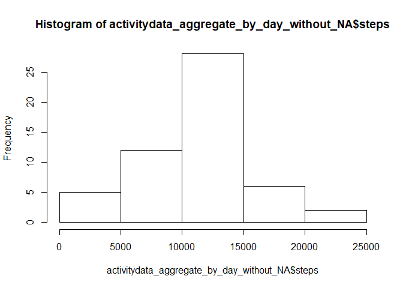
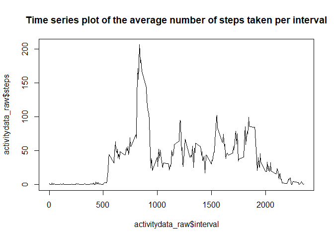
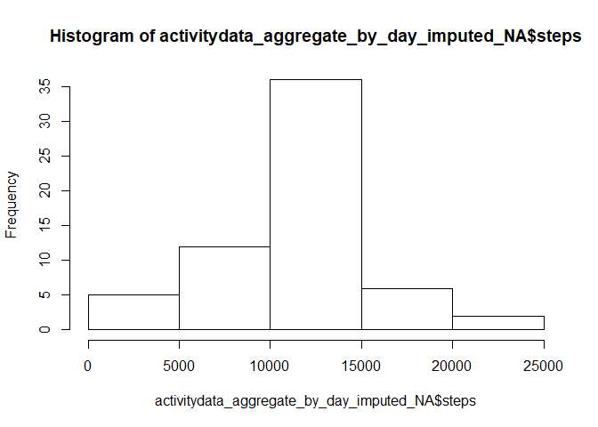
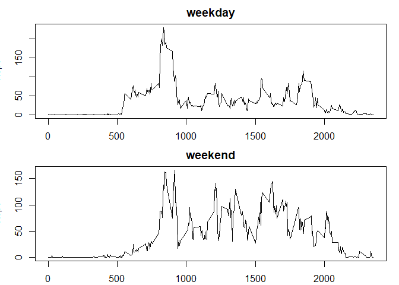

<!--
Here goes comments...
-->


## Loading and preprocessing the data

The following code allows for loading and preprocessing the data needed in this assignment:


```r
activitydata_raw <- read.csv("activity.csv")
summary(activitydata_raw)
```

```
##      steps                date          interval     
##  Min.   :  0.00   2012-10-01:  288   Min.   :   0.0  
##  1st Qu.:  0.00   2012-10-02:  288   1st Qu.: 588.8  
##  Median :  0.00   2012-10-03:  288   Median :1177.5  
##  Mean   : 37.38   2012-10-04:  288   Mean   :1177.5  
##  3rd Qu.: 12.00   2012-10-05:  288   3rd Qu.:1766.2  
##  Max.   :806.00   2012-10-06:  288   Max.   :2355.0  
##  NA's   :2304     (Other)   :15840
```

```r
colnames(activitydata_raw)
```

```
## [1] "steps"    "date"     "interval"
```

```r
head(activitydata_raw)
```

```
##   steps       date interval
## 1    NA 2012-10-01        0
## 2    NA 2012-10-01        5
## 3    NA 2012-10-01       10
## 4    NA 2012-10-01       15
## 5    NA 2012-10-01       20
## 6    NA 2012-10-01       25
```

```r
str(activitydata_raw)
```

```
## 'data.frame':	17568 obs. of  3 variables:
##  $ steps   : int  NA NA NA NA NA NA NA NA NA NA ...
##  $ date    : Factor w/ 61 levels "2012-10-01","2012-10-02",..: 1 1 1 1 1 1 1 1 1 1 ...
##  $ interval: int  0 5 10 15 20 25 30 35 40 45 ...
```

## What is mean total number of steps taken per day?
1. Calculate the total number of steps taken per day.


```r
activitydata_aggregate_by_day <- aggregate(activitydata_raw$steps ~ activitydata_raw$date, activitydata_raw, sum)
activitydata_aggregate_by_day
```

```
##    activitydata_raw$date activitydata_raw$steps
## 1             2012-10-02                    126
## 2             2012-10-03                  11352
## 3             2012-10-04                  12116
## 4             2012-10-05                  13294
## 5             2012-10-06                  15420
## 6             2012-10-07                  11015
## 7             2012-10-09                  12811
## 8             2012-10-10                   9900
## 9             2012-10-11                  10304
## 10            2012-10-12                  17382
## 11            2012-10-13                  12426
## 12            2012-10-14                  15098
## 13            2012-10-15                  10139
## 14            2012-10-16                  15084
## 15            2012-10-17                  13452
## 16            2012-10-18                  10056
## 17            2012-10-19                  11829
## 18            2012-10-20                  10395
## 19            2012-10-21                   8821
## 20            2012-10-22                  13460
## 21            2012-10-23                   8918
## 22            2012-10-24                   8355
## 23            2012-10-25                   2492
## 24            2012-10-26                   6778
## 25            2012-10-27                  10119
## 26            2012-10-28                  11458
## 27            2012-10-29                   5018
## 28            2012-10-30                   9819
## 29            2012-10-31                  15414
## 30            2012-11-02                  10600
## 31            2012-11-03                  10571
## 32            2012-11-05                  10439
## 33            2012-11-06                   8334
## 34            2012-11-07                  12883
## 35            2012-11-08                   3219
## 36            2012-11-11                  12608
## 37            2012-11-12                  10765
## 38            2012-11-13                   7336
## 39            2012-11-15                     41
## 40            2012-11-16                   5441
## 41            2012-11-17                  14339
## 42            2012-11-18                  15110
## 43            2012-11-19                   8841
## 44            2012-11-20                   4472
## 45            2012-11-21                  12787
## 46            2012-11-22                  20427
## 47            2012-11-23                  21194
## 48            2012-11-24                  14478
## 49            2012-11-25                  11834
## 50            2012-11-26                  11162
## 51            2012-11-27                  13646
## 52            2012-11-28                  10183
## 53            2012-11-29                   7047
```

2. Make a histogram of the total number of steps taken each day.

Here, I will show the histogram where the NA's are left out.

```r
activitydata_aggregate_by_day_without_NA <- na.omit(activitydata_aggregate_by_day)
colnames(activitydata_aggregate_by_day_without_NA) <- c("date", "steps")
hist(activitydata_aggregate_by_day_without_NA$steps)
```

<!-- -->

3. Calculate and report the mean and median of the total number of steps taken per day


```r
mean_without_NA <- mean(activitydata_aggregate_by_day_without_NA$steps)
mean_without_NA
```

```
## [1] 10766.19
```

```r
median_without_NA <- median(activitydata_aggregate_by_day_without_NA$steps)
median_without_NA
```

```
## [1] 10765
```

## What is the average daily activity pattern?

1. Make a time series plot of the 5-minute interval (x-axis) and the average number of steps taken, averaged across all days (y-axis)


```r
activitydata_aggregate_by_interval_mean <- aggregate(activitydata_raw$steps ~ activitydata_raw$interval, activitydata_raw, FUN=mean) 
## activitydata_aggregate_by_interval_mean
plot(activitydata_aggregate_by_interval_mean, type="l", main="Time series plot of the average number of steps taken per interval")
```

<!-- -->

2. Which 5-minute interval, on average across all the days in the dataset, contains the maximum number of steps?

```r
colnames(activitydata_aggregate_by_interval_mean)[1] <- "interval"
colnames(activitydata_aggregate_by_interval_mean)[2] <- "steps"
activitydata_aggregate_by_interval_mean[which.max(activitydata_aggregate_by_interval_mean$steps), ]
```

```
##     interval    steps
## 104      835 206.1698
```

## Imputing missing values

1. Calculate and report the total number of missing values in the dataset (i.e. the total number of rows with NAs)

```r
sum(is.na(activitydata_raw$steps))
```

```
## [1] 2304
```

2. Devise a strategy for filling in all of the missing values in the dataset. The strategy does not need to be sophisticated. For example, you could use the mean/median for that day, or the mean for that 5-minute interval, etc.

My idea is to replace the NA's by the mean of the specific interval over all days in the data set. We can use the means we've already calculated and saved in a variable called "activitydata_aggregate_by_day_mean".

3. Create a new dataset that is equal to the original dataset but with the missing data filled in.

```r
activitydata_imputed_NA <- activitydata_raw
activitydata_imputed_NA$steps[is.na(activitydata_raw$steps)] <- activitydata_aggregate_by_interval_mean$steps
```

4. Make a histogram of the total number of steps taken each day and Calculate and report the mean and median total number of steps taken per day. Do these values differ from the estimates from the first part of the assignment? What is the impact of imputing missing data on the estimates of the total daily number of steps?

The histogram of the total number of steps taken each day:


```r
activitydata_aggregate_by_day_imputed_NA <- aggregate(activitydata_imputed_NA$steps ~ activitydata_imputed_NA$date, activitydata_imputed_NA, sum)
colnames(activitydata_aggregate_by_day_imputed_NA)[1] <- "date"
colnames(activitydata_aggregate_by_day_imputed_NA)[2] <- "steps"
str(activitydata_aggregate_by_day_imputed_NA)
```

```
## 'data.frame':	61 obs. of  2 variables:
##  $ date : Factor w/ 61 levels "2012-10-01","2012-10-02",..: 1 2 3 4 5 6 7 8 9 10 ...
##  $ steps: num  10766 126 11352 12116 13294 ...
```

```r
hist(activitydata_aggregate_by_day_imputed_NA$steps)
```

<!-- -->

Comparing this histogram with the histogram where the NA's are left out, we can see that only the middle bar is affected in that it has a higher frequency now. 

The mean and median are as follows:

Mean

```r
mean_imputing_NA <- mean(activitydata_aggregate_by_day_imputed_NA$steps)
mean_imputing_NA
```

```
## [1] 10766.19
```

Median

```r
median_imputing_NA <- median(activitydata_aggregate_by_day_imputed_NA$steps)
median_imputing_NA
```

```
## [1] 10766.19
```

Comparing the mean and median with the mean and median where the NA's are left out, we can see that only the median is affected in that it has a slightly higher value now (value is now exactly the same as the mean).

## Are there differences in activity patterns between weekdays and weekends?

1. Create a new factor variable in the dataset with two levels – “weekday” and “weekend” indicating whether a given date is a weekday or weekend day.


```r
activitydata_imputed_NA$day <- weekdays(as.Date(as.character(activitydata_imputed_NA$date)))
activitydata_imputed_NA$day = ifelse(activitydata_imputed_NA$day %in% c("Saturday", "Sunday"), "weekend", "weekday")
```

2. Make a panel plot containing a time series plot (i.e. type = "l"\color{red}{\verb|type = "l"|}type="l") of the 5-minute interval (x-axis) and the average number of steps taken, averaged across all weekday days or weekend days (y-axis).


```r
activitydata_imputed_NA_wd <- subset(activitydata_imputed_NA, day == "weekday")
activitydata_imputed_NA_we <- subset(activitydata_imputed_NA, day == "weekend")
activitydata_aggregate_by_interval_mean_imputing_NA_wd <- aggregate(activitydata_imputed_NA_wd$steps ~ activitydata_imputed_NA_wd$interval, activitydata_imputed_NA_wd, FUN=mean)
activitydata_aggregate_by_interval_mean_imputing_NA_we <- aggregate(activitydata_imputed_NA_we$steps ~ activitydata_imputed_NA_we$interval, activitydata_imputed_NA_we, FUN=mean)
colnames(activitydata_aggregate_by_interval_mean_imputing_NA_wd)[1] <- "interval"
colnames(activitydata_aggregate_by_interval_mean_imputing_NA_wd)[2] <- "steps"
colnames(activitydata_aggregate_by_interval_mean_imputing_NA_we)[1] <- "interval"
colnames(activitydata_aggregate_by_interval_mean_imputing_NA_we)[2] <- "steps"
par(mfrow=c(2,1), mar=c(2.1,3.1,2.1,1.1))
plot(activitydata_aggregate_by_interval_mean_imputing_NA_wd, type="l", main="weekday")
plot(activitydata_aggregate_by_interval_mean_imputing_NA_we, type="l", main="weekend")
```

<!-- -->
